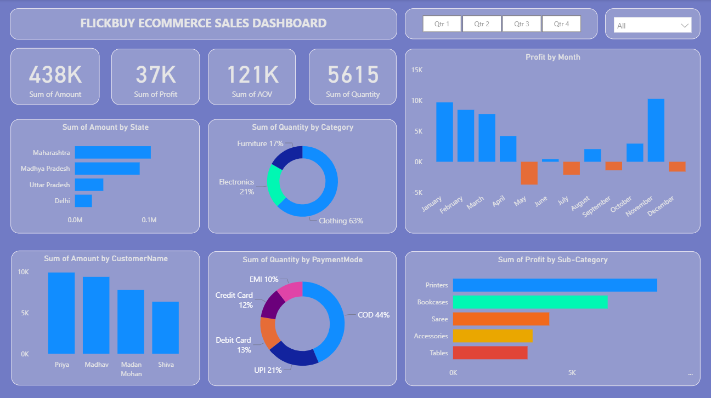

# FlickBuy Ecommerce Sales Dashboard

A Power BI dashboard project analyzing sales data for an e-commerce company, FlickBuy.

## Preview

## Features

- Total Sales, Profit, AOV, and Quantity
- Sales by State, Customer, and Category
- Profit trends by Month and Sub-Category
- Payment mode and product category insights
- Interactive slicers for Quarter and Category filtering

## Tools Used

- Power BI Desktop
- DAX
- Power Query

## Source

Dashboard inspired by this tutorial:  
[YouTube - E-Commerce Sales Dashboard](https://www.youtube.com/watch?v=6cV3OwFrOkk&t=1119s)

## Note

This project uses sample data and is for learning and portfolio purposes.
